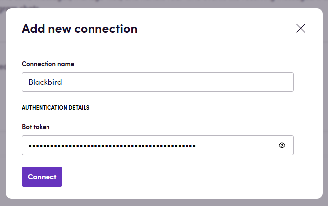

# Blackbird.io Telegram Bot

Blackbird is the new automation backbone for the language technology industry. Blackbird provides enterprise-scale automation and orchestration with a simple no-code/low-code platform. Blackbird enables ambitious organizations to identify, vet and automate as many processes as possible. Not just localization workflows, but any business and IT process. This repository represents an application that is deployable on Blackbird and usable inside the workflow editor.

## Introduction

<!-- begin docs -->

This app integrates with Telegram to send messages, manage files, and handle real-time events like receiving messages. It simplifies communication and automates interactions with Telegram chats.

## Before setting up

Before you can set up the app, you need to create a bot on Telegram. Follow these steps:

1. Open Telegram and search for the **BotFather**.
2. Start a chat with the BotFather and send the command `/newbot`.
3. Follow the prompts to set up your bot:
   - Choose a name for your bot.
4. After creating the bot, the BotFather will provide you with a **bot token**. This token is essential for connecting your bot to the Blackbird platform.
5. Save the bot token securely, as you'll need it to configure the app.

For more information on creating a bot, refer to the [Telegram Bot API documentation](https://core.telegram.org/bots/tutorial#obtain-your-bot-token).

## Connecting

1. Navigate to apps and search for **Telegram Bot**
2. Click _Add Connection_
3. Name your connection for future reference e.g., 'My Bot'
4. Fill in the following fields:
    - **Bot token**: The token you received from the BotFather when creating your bot.
5. Click _Connect_
6. Confirm that the connection has appeared and the status is _Connected_

## Actions

- **Send message**: Sends a message to a specified chat. Can send text-only messages or include a file attachment with an optional caption. You can also reply to existing messages by providing a message ID.

## Events

- **On message received**: Triggered when a message is received through your Telegram bot. Returns message details including text content, message ID, chat ID, and any attached audio files. Can be filtered by chat ID or username to listen only for specific conversations.

## Feedback

Do you want to use this app or do you have feedback on our implementation? Reach out to us using the [established channels](https://www.blackbird.io/) or create an issue.

<!-- end docs -->